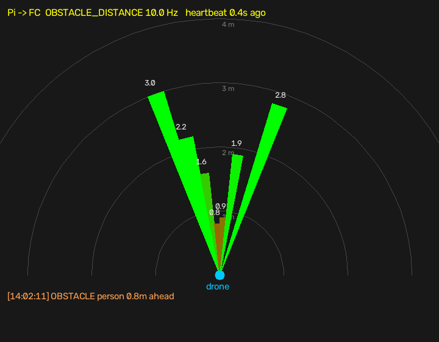

# pi5-drone-vision

Onboard vision for an obstacle-avoiding drone: a **Raspberry Pi 5** streams live video, detects objects with
**YOLOv8 on a Hailo-8L**, measures distance with an **ST VL53L5CX** 8×8 time-of-flight sensor, combines the two,
and reports obstacles to the flight controller over **MAVLink** (ArduPilot `OBSTACLE_DISTANCE`).

> **Milestone v1.0 — Camera Module 3 (2026-09-30).** The full pipeline works on the bench with the Raspberry Pi
> Camera Module 3. v2.0 will move it to the in-house **AR0234** global-shutter camera board.


## How it works

```
 Camera (CM3) ─CAM0─► MediaMTX ──► /cam    plain video, 30 fps, browser/RTSP
                          │
                          ▼
 Hailo-8L ◄─PCIe─► pi_detect.py ─┬─ YOLOv8s on the Hailo: "what"      (30 fps)
 VL53L5CX ─I²C──►  (own process) ├─ 8×8 distance grid: "how far"      (15 Hz)
                                 ├─► /detect   video with boxes + distances ("cup 0.92  21 cm")
                                 ├─► flight log  ~/detect/logs/NNNN_<date>.csv
                                 └─► MAVLink ──► flight controller (ArduPilot) / laptop fc_view
                                      OBSTACLE_DISTANCE 10 Hz · HEARTBEAT 1 Hz · STATUSTEXT alerts
```

**The Pi reports, the flight controller decides, the pilot overrides.** Avoidance is driven by the distance
sensor; YOLO only names what it is — an object YOLO doesn't know (a box, a wall) is still an obstacle.

## Results (bench, CM3)

| | Result |
|---|---|
| Glass-to-glass latency, browser page | **148 ms** average (129–169 ms) |
| Detection on the Hailo-8L (YOLOv8s, 640 px) | **~30 fps**, chip benchmark 58.8 fps; Pi CPU for detection 50–70 % |
| Cross-check vs official YOLOv8s | same objects, scores within 0.02, boxes within a few px |
| Distance sensor accuracy | tape 50 cm → 54–56 cm; tape 100 cm → 98–104 cm (±5 cm) |
| MAVLink obstacle reports | 9–10 Hz received by the laptop stand-in FC |
| 10-min soak (Hailo) | 0 restarts, `throttled=0x0`, 55–60 °C with a fan |
| Laptop detection (RTX 3050) | ~30 fps, ~0.19 s delay |
| Resilience | sensor power cut 6 s → detection kept logging at full rate, sensor reader auto-restarted |



## Hardware

Raspberry Pi 5 (8 GB) · Raspberry Pi AI HAT+ 13 TOPS (Hailo-8L) · Camera Module 3 on **CAM/DISP 0** · ST
VL53L5CX-SATEL on the GPIO header · fan on the Pi fan header · **5 V / 5 A USB-C PD supply** (weaker supplies
caused brownouts and freezes).

VL53L5CX-SATEL → GPIO (top of the AI HAT+): GND→6 · IOVDD→1 (3.3 V) · AVDD→2 (5 V, the SATEL has its own
regulator) · PWREN→11 (GPIO17) · LPn→13 (GPIO27) · SCL→5 · SDA→3 · I2C_RST→9 (GND) · INT→7 (optional).

## Repository

| Path | What |
|---|---|
| `pi/pi_detect.py` | The pipeline: detection (Hailo `.hef` or CPU `.onnx`), distance fusion, `/detect`, flight log, MAVLink |
| `pi/mavlink_out.py` | Obstacle reports for ArduPilot (`OBSTACLE_DISTANCE`, `HEARTBEAT`, `STATUSTEXT`) |
| `pi/tof_test.py` | Read and print the VL53L5CX 8×8 grid |
| `pi/mediamtx/cam.yml`, `pi/systemd/*.service` | Camera server config and the two boot services |
| `pi/ar0234/` | AR0234 power-timing device-tree overlay (Pi 5 version, covers both camera connectors) |
| `laptop/fc_view.py` | Stand-in flight controller: radar of what ArduPilot would receive |
| `laptop/detect.py` | YOLO on the laptop GPU from the Pi's stream |
| `laptop/latency-test.html` | Stopwatch page for the glass-to-glass latency test |
| `training/` | Indoor dataset config and helpers for YOLO fine-tuning |
| `docs/guide.html` | Full build guide, ordered by phase (open in a browser) |
| `docs/PROGRESS.md` | Build log: every result, fault and fix |

## Setup (short)

On the Pi (Raspberry Pi OS 64-bit, trixie):
```bash
sudo apt install -y dkms hailo-all i2c-tools          # Hailo-8L runtime 4.x (NOT hailo-h10-all)
sudo raspi-config nonint do_i2c 0
echo "dtparam=i2c_arm_baudrate=400000" | sudo tee -a /boot/firmware/config.txt
# MediaMTX: download the linux_arm64 release to ~/mediamtx, copy pi/mediamtx/cam.yml there
python3 -m venv --system-site-packages ~/detect/.venv
~/detect/.venv/bin/pip install onnxruntime opencv-python-headless numpy vl53l5cx-ctypes smbus2 pymavlink
cp pi/*.py ~/detect/
sudo cp pi/systemd/*.service /etc/systemd/system/ && sudo systemctl enable --now mediamtx pi-detect
```
**Login for the pages:** `cam.yml` ships with a placeholder. Set `pass:` to `sha256:` + base64(sha256(password)):
```bash
python3 -c "import hashlib,base64,getpass; print('sha256:'+base64.b64encode(hashlib.sha256(getpass.getpass().encode()).digest()).decode())"
```
Then open `http://<pi>:8889/detect` (user `viewer`). Laptop radar: `laptop\fc_view.ps1`. Full details and every
fix: `docs/guide.html` and `docs/PROGRESS.md`.

## Lessons that shaped the code

- **Nothing may stall the obstacle reports.** The video publisher runs on its own thread with a watchdog; the
  distance sensor runs in its own process (a frozen I²C sensor used to hold Python's GIL and starve everything).
- **The Pi has no battery clock.** At boot the date is wrong, then jumps: logs are numbered, timelines monotonic.
- **Stop the detector with `systemctl`**, never a plain kill: the Hailo must be closed cleanly.
- **Power first.** Brownouts looked like network lag, camera faults and freezes.
- The CM3 ribbon connectors are the weakest mechanical point: fix the camera and strain-relieve the ribbon.

## Known limits / next

- The COCO model has no door/window/wall classes; an indoor fine-tune (round 1: mAP50 0.33) was **not** good
  enough — round 2 needs the drone camera's own indoor photos.
- VL53L5CX: ~4 m indoors, much less in sunlight, 45° forward only; glass may be invisible to it.
- The real flight controller link (J11 UART, ArduPilot params) is still to test; so far a laptop stand-in.
- **v2.0:** the AR0234 global-shutter mono camera (`dtoverlay=ar0234,4lane,cam0` + `pi/ar0234/` overlay).

## Credits

Indoor Objects dataset (Roboflow Universe, project-tgiyj/indoor-objects-4uctj) — **CC BY 4.0**. Built on
[MediaMTX](https://github.com/bluenviron/mediamtx), [Ultralytics YOLO](https://github.com/ultralytics/ultralytics),
[Hailo / Raspberry Pi AI HAT+](https://www.raspberrypi.com/documentation/accessories/ai-hat-plus.html),
[pymavlink](https://github.com/ArduPilot/pymavlink),
[vl53l5cx-python](https://github.com/pimoroni/vl53l5cx-python) (Pimoroni, wrapping ST's ULD).

Internal project — Gamuda. The AR0234 board and the GAMUDA_EVT1 flight controller referenced in `docs/` are
in-house designs; keep this repository private unless cleared.
