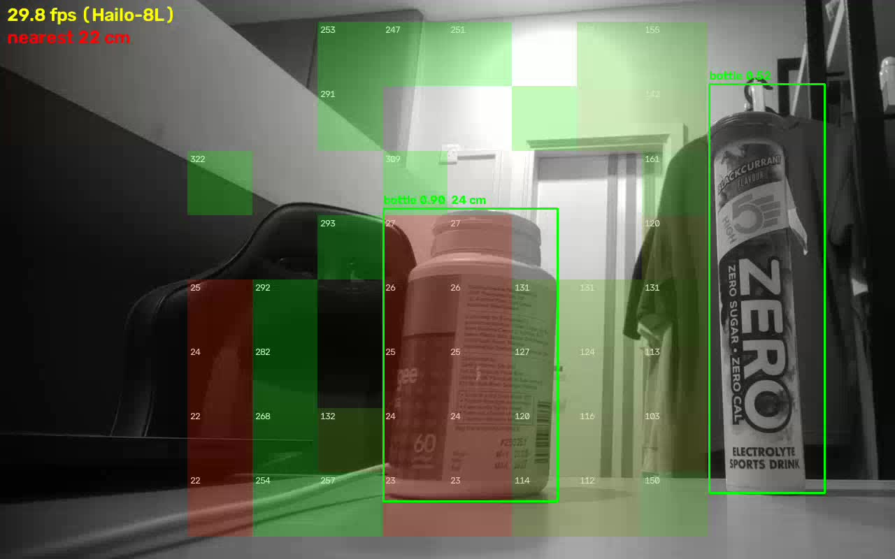
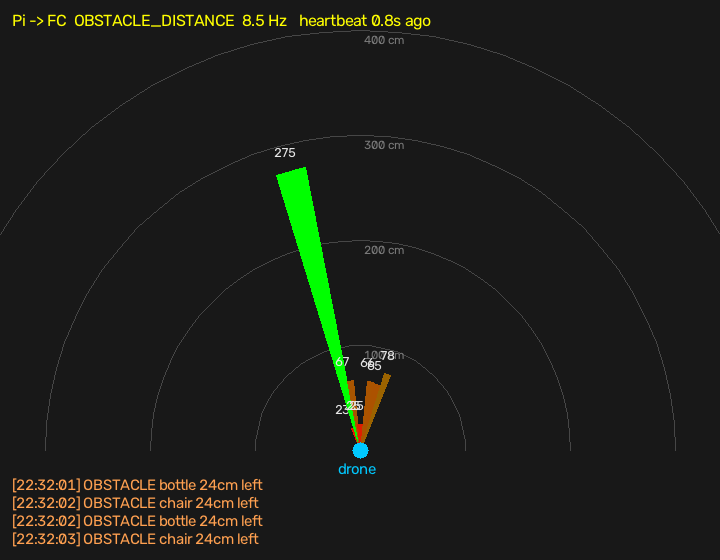
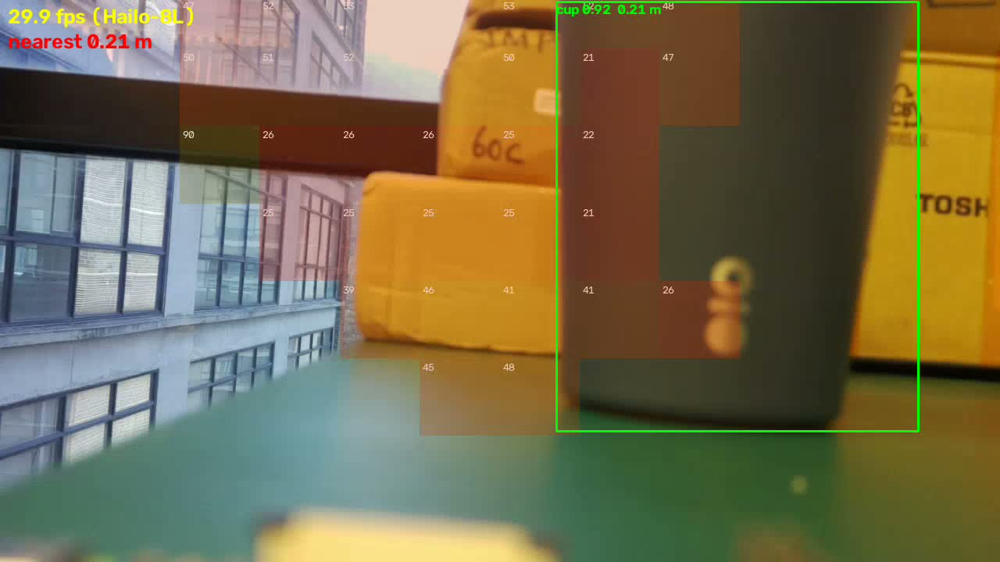
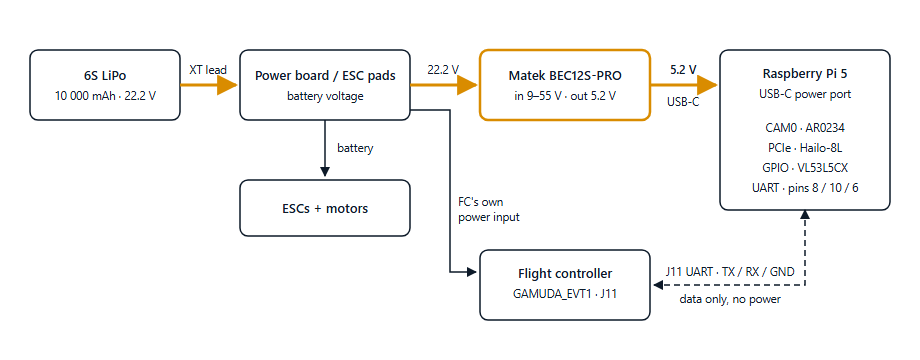

# pi5-drone-vision

Onboard vision for an obstacle-avoiding drone: a **Raspberry Pi 5** streams live video, detects objects with
**YOLOv8 on a Hailo-8L**, measures distance with an **ST VL53L5CX** 8×8 time-of-flight sensor, combines the two,
and reports obstacles to the flight controller over **MAVLink** (ArduPilot `OBSTACLE_DISTANCE`).

| Camera | Role | Release |
|---|---|---|
| **AR0234** — in-house global-shutter mono board ([ar0234-camera-board](https://github.com/Ivanlim556/ar0234-camera-board)) | **Main camera** since 2026-10-05 | `v2.0-ar0234` (latest) |
| Raspberry Pi **Camera Module 3** | **Backup** — one command switches back | `v1.0-cm3` |

**This repository = the system:** what runs on the Pi with either camera, how it is set up and how it talks to the
flight controller. **The AR0234 board itself** (schematic, PCB, BOM, fabrication, tests) is in its own repository:
[ar0234-camera-board](https://github.com/Ivanlim556/ar0234-camera-board).

Scope: this repository is the Pi side, ending at the MAVLink obstacle reports. The avoidance itself (ArduPilot
`AVOID_*` / `OA_*` tuning, flying) is the flight-controller team's part.



## How it works

```
 Camera ─CAM0─► MediaMTX ──► /cam    plain video, 30 fps, browser / RTSP
 (AR0234 via rpicam-vid,          │
  CM3 read directly)              ▼
 Hailo-8L ◄─PCIe─► pi_detect.py ─┬─ YOLOv8s on the Hailo: "what"         (30 fps)
 VL53L5CX ─I²C──►  (own process) ├─ 8×8 distance grid: "how far"         (~6–7 Hz at 100 kHz I²C)
                                 ├─► /detect   video with boxes + distances ("person 0.80  47 cm")
                                 ├─► flight log  ~/detect/logs/NNNN_<date>.csv
                                 └─► MAVLink ──► flight controller (ArduPilot) / laptop fc_view
                                      OBSTACLE_DISTANCE ~10 Hz · HEARTBEAT 1 Hz · STATUSTEXT alerts
```

**The Pi reports, the flight controller decides, the pilot overrides.** Avoidance is driven by the distance
sensor; YOLO only names what it is — an object YOLO doesn't know (a box, a wall) is still an obstacle.

## Automatic: what starts by itself

Nothing needs a keyboard, screen or SSH — power on and within ~40 s:

1. **`mediamtx.service`** starts the camera server with `~/mediamtx/cam.yml`. For the AR0234 that file tells MediaMTX
   to launch `rpicam-vid` itself and restart it if it stops (`runOnInit` / `runOnInitRestart`).
2. **`pi-detect.service`** starts `pi_detect.py`, which by itself:
   - uses the **Hailo-8L** if `/dev/hailo0` exists (`yolov8s_h8l.hef`), otherwise the CPU (`yolo11n-320.onnx`, 15 fps);
   - reads `/boot/firmware/config.txt` to know **which camera** is selected and picks the matching distance-grid
     orientation, field of view and parallax baseline (AR0234: `lrt`, `0.58,0.92`, 9.5 cm · CM3: `udlr`,
     `0.64,1.10`, 0);
   - powers the VL53L5CX (PWREN/LPn), runs it in its own process and power-cycles it if it stops answering for 3 s;
   - publishes `/detect`, writes the flight log, and sends MAVLink obstacle reports.
3. Both services restart on any failure (`Restart=always`); a stalled video publisher is restarted by a watchdog;
   if detection stalls for 15 s (e.g. a Hailo transfer error) the process exits and is restarted, and if the
   Hailo then won't open it carries on with YOLO11n on the CPU (15 fps) until a reboot resets the chip.

## Software and firmware (as running, 2026-10-05)

| Layer | Version |
|---|---|
| OS / kernel | Raspberry Pi OS (Debian 13 trixie) 64-bit · `6.18.50+rpt-rpi-2712` · Pi EEPROM 2026-05-26 |
| Hailo-8L | `hailo-all` 5.1.1 → HailoRT **4.23.0**, device firmware **4.23.0** · model `/usr/share/hailo-models/yolov8s_h8l.hef` (NMS on the chip) |
| Camera stack | libcamera **0.7.2** (Kurokesu build `1:0.7.2+rpt20260817+krks4-1`, adds AR0234) · rpicam-apps 1.13.0 (stock) |
| AR0234 driver | Kurokesu `ar0234-rpi-dkms` **0.1.2** + `pi/ar0234/ar0234-force-mono.patch` · tuning `ar0234_mono.json` |
| AR0234 overlays | `dtoverlay=ar0234,4lane,cam0` + `dtoverlay=ar0234-gamuda-power` (this repo, Pi 5 power-up timing) |
| Streaming | MediaMTX **v1.21.1** (WebRTC 8889, RTSP 8554, HLS 8888) |
| Python 3.13.5 venv | pymavlink 2.4.50 · vl53l5cx-ctypes 0.0.3 · onnxruntime 1.30.0 · opencv-python-headless · numpy 2.5.3 · smbus2 |
| Laptop | Python venv (uv) with Ultralytics + PyTorch CUDA for `detect.py`; pymavlink for `fc_view.py` |

## Results (bench)

| | AR0234 (main, 2026-10-05) | CM3 (backup, 2026-09-26/30) |
|---|---|---|
| Video | 1280×800 at 30 fps (full 1920×1200 view, 70° lens) | 1280×720 at 30 fps |
| Glass-to-glass latency (browser) | **~180 ms** | **148 ms** |
| Detection on the Hailo-8L | 29.9 fps · person 0.80, laptop 0.73 (mono does not hurt YOLO) | ~30 fps · matches official YOLOv8s within 0.02 |
| 10-min run | 0 link errors, 63–65 °C, `throttled=0x0` | 0 restarts, 55–60 °C, `throttled=0x0` |
| Long run | — | 77 h: 0 camera errors, 0 sensor freezes (I²C 100 kHz) |

Distance sensor: tape 50 cm → 54–56 cm, 100 cm → 98–104 cm (maximum error 6 cm). MAVLink: ~10 obstacle reports a second.

What the flight controller receives from that same scene — `laptop/fc_view.py` (`--test 4 --save radar.png` writes it
without a window): 8 slices across the 45° in front, 8.5 reports a second, nearest 23–25 cm, plus the warnings.



## Hardware

Raspberry Pi 5 (8 GB) · Raspberry Pi AI HAT+ 13 TOPS (Hailo-8L) · camera on **CAM/DISP 0** (this Pi's CAM1 is
faulty) · ST VL53L5CX-SATEL on the GPIO header · fan on the Pi fan header · **5 V / 5 A USB-C PD supply** (weaker
supplies caused brownouts and freezes).

- **AR0234 board** — schematic, Gerbers, BOM, pick-and-place, photos, how it was designed (EasyEDA Pro) and made
  (JLCPCB), test points, test results and next-revision improvements: **[ar0234-camera-board](https://github.com/Ivanlim556/ar0234-camera-board)** (its own repo).
  Lens: Arducam M12 4 mm (M2504ZH05S, ~70° across), focused at 3–5 m.
- **VL53L5CX-SATEL → GPIO:** GND→6 · IOVDD→1 (3.3 V) · AVDD→2 (5 V) · PWREN→11 (GPIO17) · LPn→13 (GPIO27) ·
  SCL→5 · SDA→3 · I2C_RST→9 (GND) · INT→7 (optional).
- **Sensor mounting (AR0234 bench rig):** the VL53L5CX sits **9.5 cm beside the lens**, both **upright and facing
  straight ahead, parallel**. `pi_detect.py` corrects the parallax per zone from that gap (`--tof-baseline 0.095`,
  default with the AR0234): without it a box 50 cm away got the wall's distance; with it, its own. **If you move the
  sensor, set the new gap** (metres, + = the way it is now; 0 = off). A sensor leaning back by ~10° puts the readings
  ~2 rows low — stand it upright. Closer to the lens is always better (less parallax at short range).

## Repository

| Path | What |
|---|---|
| `pi/pi_detect.py` | The pipeline: detection (Hailo `.hef` or CPU `.onnx`), distance fusion, `/detect`, flight log, MAVLink |
| `pi/mavlink_out.py` | Obstacle reports for ArduPilot (`OBSTACLE_DISTANCE`, `HEARTBEAT`, `STATUSTEXT`) |
| `pi/tof_test.py` | Read and print the VL53L5CX 8×8 grid |
| `pi/mediamtx/cam.yml` · `cam-ar0234.yml` | Camera server config: CM3 (MediaMTX reads the camera) · AR0234 (rpicam-vid feeds it) |
| `pi/systemd/*.service` | The two boot services |
| `pi/ar0234/camera` | `sudo camera cm3` / `sudo camera ar0234` — switches boot config **and** stream config |
| `pi/ar0234/ar0234-force-mono.patch` | Driver patch: the mono sensor reports the colour chip ID |
| `pi/ar0234/ar0234-gamuda-power-overlay.dts` | Pi 5 power-timing overlay for the AR0234 board |
| `pi/ar0234/bootcheck.sh` | Optional: logs chip ID + stream at every boot (user crontab `@reboot`) |
| `laptop/fc_view.py` | Stand-in flight controller: radar of what ArduPilot would receive |
| `laptop/detect.py` | YOLO on the laptop GPU from the Pi's stream |
| `laptop/latency-test.html` | Stopwatch page for the glass-to-glass latency test |
| `training/` | Indoor dataset config and helpers for YOLO fine-tuning |
| `docs/guide.html` | Full build guide, ordered by phase (open in a browser) |
| `docs/PROGRESS.md` | Build log: every result, fault and fix |
| `docs/HANDOVER.html` | Team handover: log in, commands, FC link, wiring, troubleshooting, what's left (no passwords) |

## Setup

### 1. Common (both cameras)

On the Pi (Raspberry Pi OS 64-bit, trixie):
```bash
sudo apt install -y dkms hailo-all i2c-tools          # Hailo-8L runtime 4.x (NOT hailo-h10-all)
sudo raspi-config nonint do_i2c 0
echo "dtparam=i2c_arm_baudrate=100000" | sudo tee -a /boot/firmware/config.txt   # 400 kHz froze the sensor now and then
# MediaMTX v1.21.1: download the linux_arm64 release to ~/mediamtx
python3 -m venv --system-site-packages ~/detect/.venv
~/detect/.venv/bin/pip install onnxruntime opencv-python-headless numpy vl53l5cx-ctypes smbus2 pymavlink
cp pi/*.py ~/detect/
cp pi/mediamtx/cam.yml ~/mediamtx/cam-cm3.yml && cp pi/mediamtx/cam-ar0234.yml ~/mediamtx/
sudo install -m 755 pi/ar0234/camera /usr/local/bin/camera
sudo cp pi/systemd/*.service /etc/systemd/system/ && sudo systemctl enable mediamtx pi-detect
```
**Login for the pages:** the `cam*.yml` files ship with a placeholder. Set `pass:` in both to `sha256:` +
base64(sha256(password)):
```bash
python3 -c "import hashlib,base64,getpass; print('sha256:'+base64.b64encode(hashlib.sha256(getpass.getpass().encode()).digest()).decode())"
```

### 2. AR0234 (main)

The board goes on **CAM0** with a 22-to-22 cable whose contacts face the pads at **both** ends (blue stiffener away
from the board at J1) — the wrong way round gives `failed to read chip id` and 0 V on the board.
```bash
# Kurokesu repo + apt pin (so it can never replace the stock camera packages): docs/guide.html 2.1
sudo apt install -y ar0234-rpi-dkms device-tree-compiler
V=1:0.7.2+rpt20260817+krks4-1     # libcamera with AR0234 support: same release as stock, 5 packages, nothing removed
sudo apt install libcamera0.7=$V libcamera-ipa=$V libcamera-tools=$V libcamera-v4l2=$V python3-libcamera=$V
# Pi 5 power-timing overlay
dtc -@ -I dts -O dtb -o ar0234-gamuda-power.dtbo pi/ar0234/ar0234-gamuda-power-overlay.dts
sudo cp ar0234-gamuda-power.dtbo /boot/firmware/overlays/
# the fitted mono sensor reports the colour chip id 0x0A56 -> force mono
cd /usr/src/ar0234-rpi-dkms-0.1.2 && sudo patch -p1 < ~/pi5-drone-vision/pi/ar0234/ar0234-force-mono.patch
sudo dkms build -m ar0234-rpi-dkms -v 0.1.2 --force && sudo dkms install -m ar0234-rpi-dkms -v 0.1.2 --force
echo "options ar0234 force_mono=1" | sudo tee /etc/modprobe.d/ar0234.conf
sudo camera ar0234 && sudo reboot
```
Check: `journalctl -k -b | grep "chip id"` → `Success reading chip id: 0xa56`; `rpicam-hello --list-cameras` →
`ar0234 [1920x1200 10-bit MONO]`. After a kernel or driver update, re-apply the patch.

### 3. CM3 (backup)

Plug the CM3 into **CAM0** (Pi off), then:
```bash
sudo camera cm3 && sudo reboot      # auto-detect on; MediaMTX reads the CM3 itself (180° flip, focus at infinity)
```
Nothing else changes: the same pages, detection, distances (the sensor settings switch with the camera) and MAVLink.



Then open `http://<pi>:8889/cam` or `/detect` (user `viewer`). Laptop radar: `laptop\fc_view.ps1`. Every result and
fix: `docs/guide.html` and `docs/PROGRESS.md`.

## Lessons that shaped the code

- **Nothing may stall the obstacle reports.** The video publisher runs on its own thread with a watchdog; the
  distance sensor runs in its own process (a frozen I²C sensor used to hold Python's GIL and starve everything).
- **The Pi has no battery clock.** At boot the date is wrong, then jumps: logs are numbered, timelines monotonic.
- **Stop the detector with `systemctl`**, never a plain kill: the Hailo must be closed cleanly.
- **Power first.** Brownouts looked like network lag, camera faults and freezes.
- **Ribbons and jumpers are the weak points:** a reversed camera cable looked like a dead board; a jumper loosened in
  transport stopped the distance sensor, and handling the board while running dropped the camera ("frontend has
  timed out"). Put the Pi, camera and sensor on **one rigid base**; tape the ribbon flat 1–2 cm from each connector
  with slack between; solder (or hot-glue) the sensor wires and tape the bundle; never touch the cable while powered.

## Known limits / next

- The COCO model has no door/window/wall classes; an indoor fine-tune (round 1: mAP50 0.33) was **not** good
  enough — round 2 needs the drone camera's own indoor photos.
- VL53L5CX: ~4 m indoors, much less in sunlight, **45° forward only** (the FC knows nothing about the sides);
  glass may be invisible to it; a hand at 1 m is smaller than one of its zones.
- The real flight controller link (USB / J11 UART) is still to test with the FC team; so far a laptop stand-in.
- AR0234: lens lock and a joint camera + sensor mount needed for flight; latency could drop ~35 ms by letting
  rpicam-vid publish RTSP directly (no ffmpeg).

## Status and handover

**v2.0 is bench-complete** (Pi side): camera, detection, distance, MAVLink obstacle reports all working and tested.
Drone integration is handed over to the team, in order: FC bench test over USB → J11 wired link → avoidance
settings (FC team) → mounting (camera + sensor in one mount, soldered sensor wires, lens lock, 5 V/5 A BEC).

Power on the drone (6S LiPo → Matek BEC12S-PRO at 5.2 V → USB-C pigtail → Pi; the FC link carries data only):


Details: **[`docs/HANDOVER.html`](docs/HANDOVER.html)** — the team handover page (log in, everyday commands, FC link,
wiring, troubleshooting, what's left; download and open in a browser) — and `docs/guide.html` (status box).
Passwords are not in this repository: ask the team lead.

## Credits

Indoor Objects dataset (Roboflow Universe, project-tgiyj/indoor-objects-4uctj) — **CC BY 4.0**. Built on
[MediaMTX](https://github.com/bluenviron/mediamtx), [Ultralytics YOLO](https://github.com/ultralytics/ultralytics),
[Hailo / Raspberry Pi AI HAT+](https://www.raspberrypi.com/documentation/accessories/ai-hat-plus.html),
[pymavlink](https://github.com/ArduPilot/pymavlink),
[vl53l5cx-python](https://github.com/pimoroni/vl53l5cx-python) (Pimoroni, wrapping ST's ULD),
[Kurokesu AR0234 driver](https://github.com/Kurokesu/ar0234-rpi-driver).

Gamuda internship project (Lim Wei Quan, 2026). The AR0234 camera board is published separately in
[ar0234-camera-board](https://github.com/Ivanlim556/ar0234-camera-board); the GAMUDA_EVT1 flight controller
referenced in `docs/` is a Gamuda in-house design. No passwords are stored in this repository.
