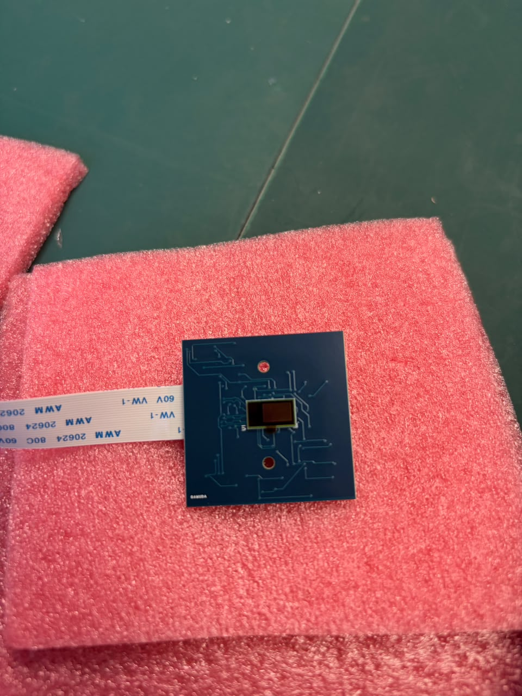
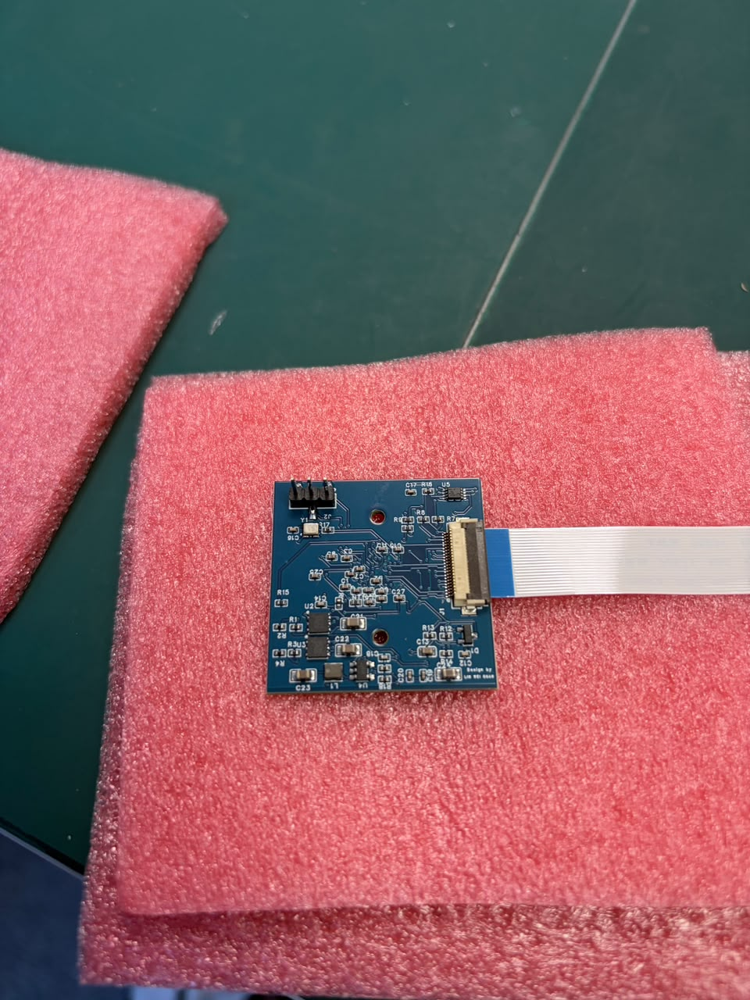
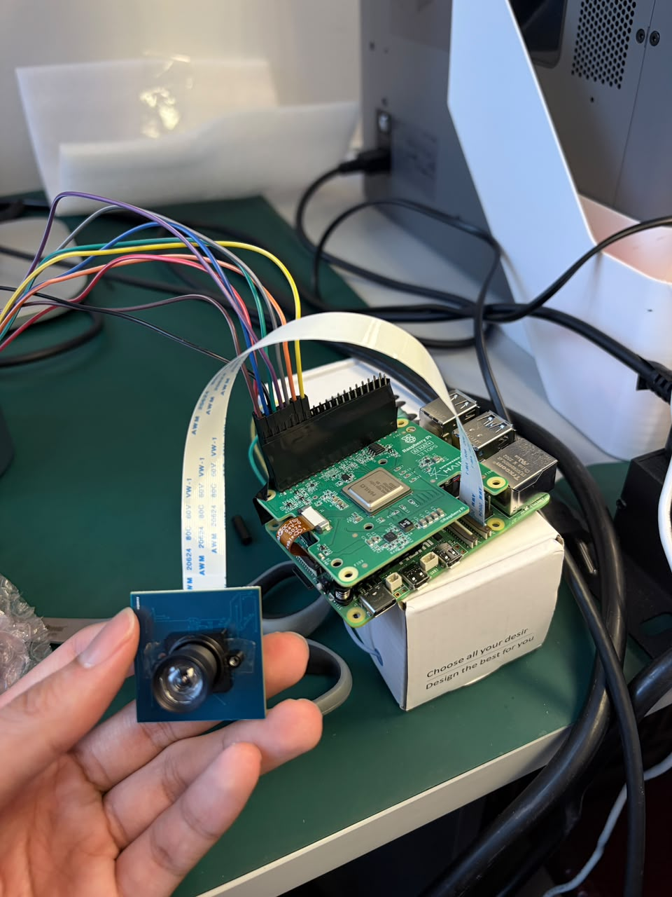
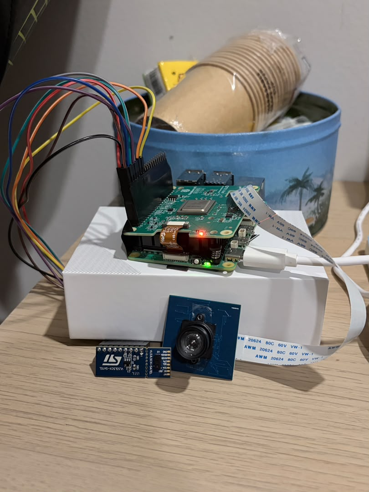
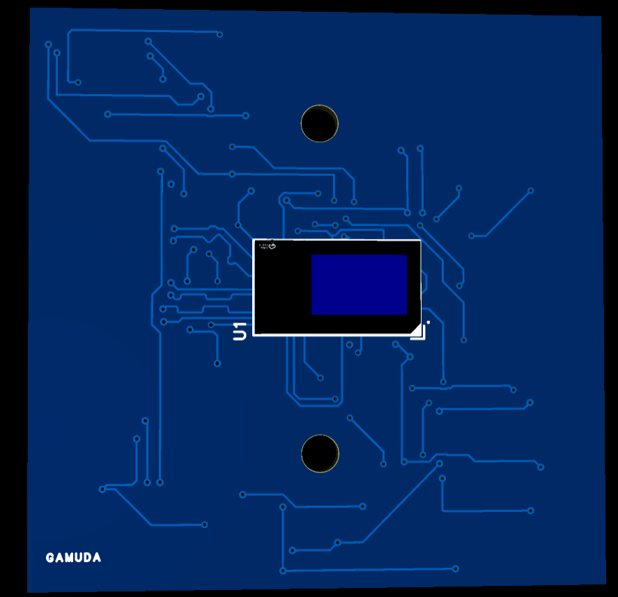
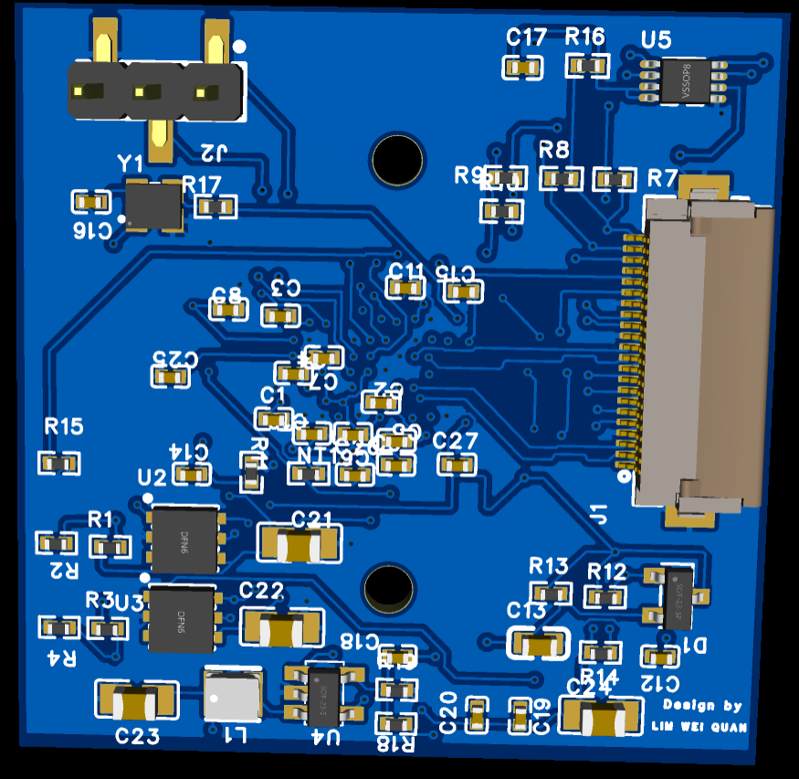
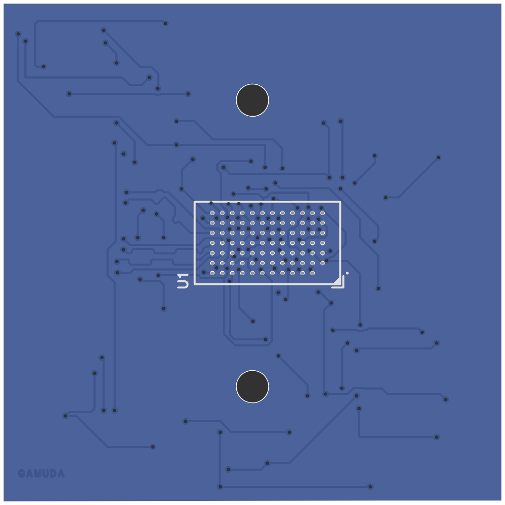
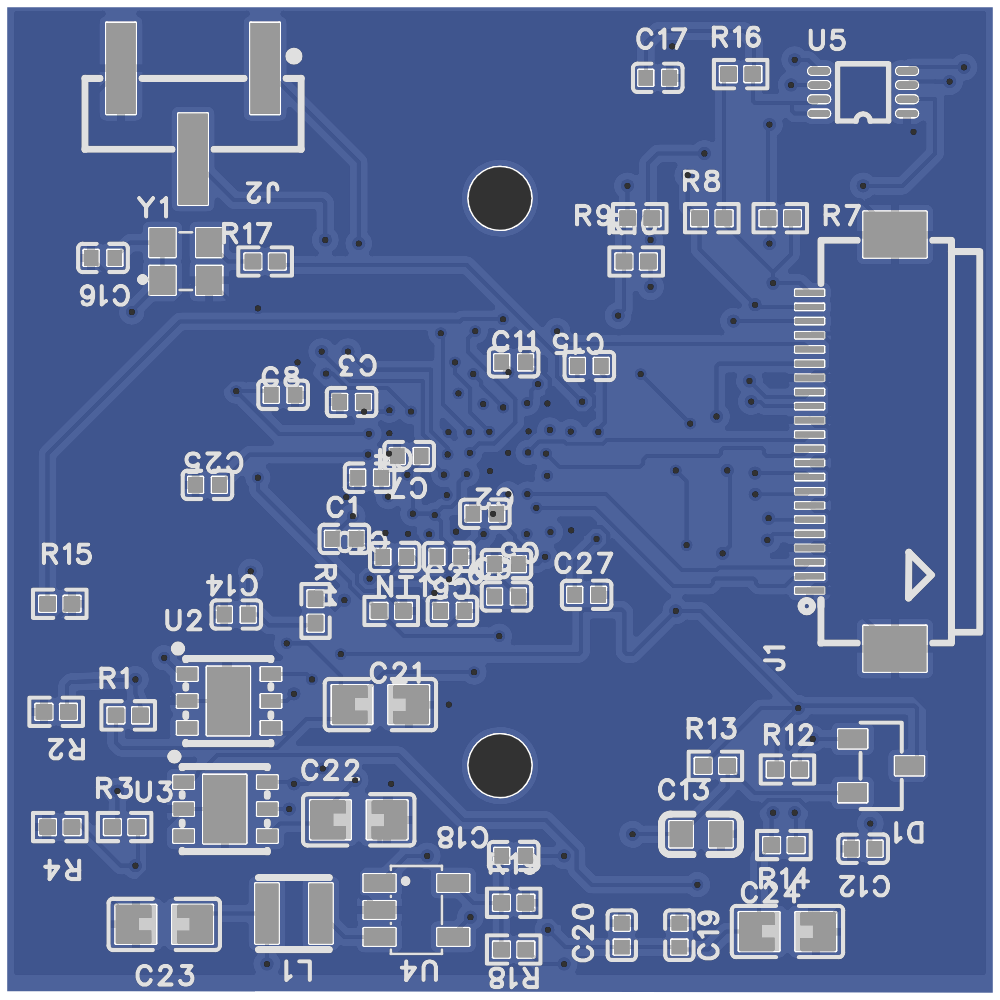

# AR0234 camera board (in-house)

A 35 × 35 mm global-shutter **mono** camera board for the drone, built around the onsemi **AR0234** (1920×1200,
MIPI CSI-2, 4 lanes). It plugs into the Raspberry Pi 5's CAM/DISP 0 with a 22-pin ribbon and is working since
**2026-10-05** (1280×800 at 30 fps, ~180 ms glass to glass — see the main README and `docs/guide.html` 2.0).

Designed by Lim Wei Quan (Gamuda internship, 2026). Board revision **2026-09-13**.

| Front (sensor) | Back (J1 ribbon connector) |
|---|---|
|  |  |

| With M12 holder + 70° lens, on the Pi 5 + AI HAT+ | Bench setup with the VL53L5CX distance sensor |
|---|---|
|  |  |

## Design (before fabrication)

EasyEDA Pro 3D view of the final design:

| Top — sensor side (AR0234, lens-holder holes) | Bottom — components |
|---|---|
|  |  |

Rendered from the exact Gerber files sent to JLCPCB (`fabrication/Gerber_ar0234-camera_2026-09-13.zip`, drawn with
[gerbonara](https://gitlab.com/gerbolyze/gerbonara); solder mask coloured blue to match the boards that came back).

| Top — sensor side (U1 AR0234, lens-holder holes) | Bottom — components (J1 ribbon, J2, regulators, clock, level shifter) |
|---|---|
|  |  |

Designed in EasyEDA Pro (schematic → 4-layer PCB, DRC, one-click Gerber/BOM/CPL export). The bottom render is seen
from below, as in the photo of the back.

## Files

| File | What |
|---|---|
| `SCH_ar0234-camera_2026-09-13.pdf` | Schematic |
| `fabrication/Gerber_ar0234-camera_2026-09-13.zip` | Gerber + drill files as sent for manufacture (4 layers) |
| `fabrication/BOM_ar0234-camera_PCB2_2026-09-13.xlsx` | Bill of materials, 23 lines / 55 parts, with LCSC part numbers |
| `fabrication/PickAndPlace_PCB2_2026_09_13.xlsx` | Component placement (CPL) for assembly |
| `fabrication/Netlist_ar0234-camera_2026-09-13.tel` | Netlist (handy for finding test points) |
| `../../pi/ar0234/ar0234-gamuda-power-overlay.dts` | Pi 5 device-tree overlay for this board's power-up timing |

## How it was made

- **Design:** EasyEDA Pro v3.2.148 (schematic + PCB). Gerbers exported 2026-09-13.
- **Fabrication + assembly:** JLCPCB — PCB and SMT assembly from the Gerber, BOM and CPL above; all parts from LCSC
  (JLCPCB's parts house), so every BOM line carries an LCSC number (`Cxxxxx`).
- **Board:** 4 layers, 1.585 mm, 35 × 35 mm, mounting holes 20 mm apart, 55 placed parts, 0.20 mm drills ×134.

## Circuit in short

| Block | Parts |
|---|---|
| Sensor | U1 **AR0234CSSM00SUKA0-CP** (mono, ODCSP-83), I²C address **0x10** |
| Power in | **+3V3** from the Pi on J1 pin 22 |
| Rails | U2 LD39050 → **+2V8** (115 mA) · U3 LD39050 → **+1V8** (13 mA) · U4 TLV62568 buck + L1 2.2 µH → **+1V2** (250 mA) |
| Power sequencing | EN_RAW (J1.17) → D1 BAT54C + RC delays: 2.8 V, then 1.8 V, then 1.2 V; reset released via R11/C14 |
| Clock | Y1 24.000 MHz oscillator → EXTCLK via R17 33 Ω |
| I²C | U5 TCA39306 level shifter (3.3 V ribbon side ↔ 1.8 V sensor side), R7/R8 2.7 kΩ pull-ups |
| Connectors | J1 Hirose FH12-22S-0.5SH (22-pin, 0.5 mm, Pi 5 pinout, 4 lanes) · J2 3-pin: 1 FLASH, 2 TRIGGER, 3 GND |

**Test points** (big 10 µF caps, rail to GND): **C24** = +3V3 in · **C21** = +2V8 · **C22** = +1V8 · **C23** = +1V2 ·
GND at **J2 pin 3**.

## Bring-up notes (arrival day, 2026-10-05)

1. **Cable direction matters.** The ribbon's bare contacts must face the pads at **both** ends (blue stiffener away
   from the board at J1). The wrong way gives 0 V on C24 and `failed to read chip id`.
2. **The mono sensor reports the colour chip ID `0x0A56`** (the driver expects `0x1A56` for mono). Raw frames prove
   it is mono. Fix: `pi/ar0234/ar0234-force-mono.patch` + `options ar0234 force_mono=1`.
3. Driver: Kurokesu `ar0234-rpi-dkms` + their libcamera (standard libcamera has no AR0234). Full steps: main README,
   "AR0234 setup (v2.0)".

## Known limits of this revision

- **TRIGGER (J2 pin 2) has no pull-down** — it floats. Master mode (the default) ignores it; don't use
  external-trigger / sync-sink modes without adding 10 kΩ from J2 pin 2 to pin 3.
- **MIPI traces are 0.120 mm** where 100 Ω wants 0.127 mm; pairs matched under 0.10 mm. Fine at the tested
  450 MHz link; suspect it first if a long cable or higher rate gives CRC errors.
- **R7/R8 pull-ups** sit in parallel with the Pi's (~1.2 kΩ combined) — legal at 400 kHz.
- **FLASH (J1 pin 18)** is a sensor output on a pin the Pi may also drive: tape contact 18 at the camera end, or use
  FLASH from J2 pin 1.
